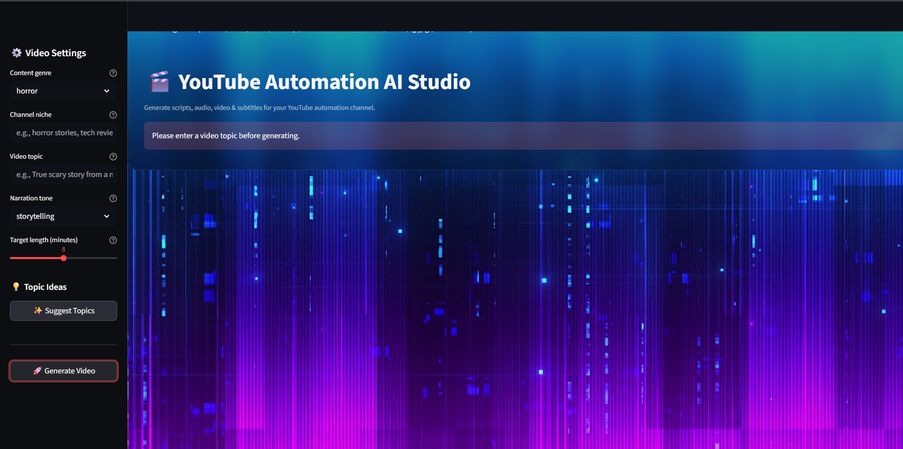

# YouTube Automation AI

An end-to-end AI-powered pipeline that generates scripts, voiceovers, videos, subtitles, and YouTube metadata from a single Streamlit interface.

## Features

- Script generation - genre and tone-aware narration scripts
- Topic suggestions - auto-generates relevant video ideas
- Voiceover - converts scripts to MP3 using text-to-speech
- Video creation - assembles MP4 with genre-matched background and audio
- Subtitle generation - proportional-timing SRT files synced to audio
- YouTube metadata - titles, descriptions, tags, and CTAs ready to copy

## Tech Stack

- Python 3.10+
- Streamlit
- MoviePy
- gTTS
- LLM API (pluggable)

## Setup

Clone and run locally:

    git clone https://github.com/Manish10Lohani/Youtube-Automation-AI.git
    cd Youtube-Automation-AI
    python -m venv venv
    venv\Scripts\activate
    pip install -r requirements.txt
    streamlit run src/app/dashboard.py

## License

MIT License
